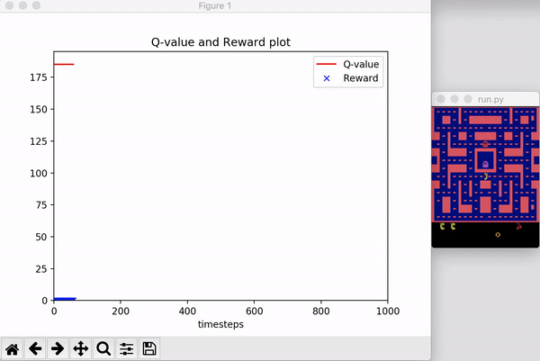
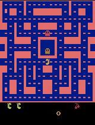

# Pacman-RL

Implement some classic reinforcement learning algorithms, test and visualize on Pacman under [OpenAI's Gym](https://gym.openai.com/) environment.

## Requirements

* Python 3.6+
* gym
* matplotlib
* tensorflow
* keras
* mujoco_py (if you want to save replay)

## Run

* Run `python run.py --controller MC train` for training using Monte-Carlo control. The weight file will be saved as `weights/mc.h5`.
* Run `python run.py --controller MC --render --show_plot --evaluate_episodes 10 evaluate` for evaluation using Monte-Carlo control. It will render the Pacman environment and show the dynamic Q-value and reward plot at the same time.

```
Full usage: run.py [-h]
              [--controller {MC,Sarsa,Sarsa_lambda,Q_learning,REINFORCE,ActorCritic}]
              [--render] [--save_replay] [--save_plot] [--show_plot]
              [--num_episodes NUM_EPISODES] [--batch_size BATCH_SIZE]
              [--eva_interval EVA_INTERVAL]
              [--evaluate_episodes EVALUATE_EPISODES] [--lr LR]
              [--epsilon EPSILON] [--gamma GAMMA] [--lam LAM] [--forward]
              [--max_workers MAX_WORKERS]
              {train,evaluate}

positional arguments:
  {train,evaluate}      what to do

optional arguments:
  -h, --help            show this help message and exit
  --controller {MC,Sarsa,Sarsa_lambda,Q_learning,REINFORCE,ActorCritic}
                        choose an algorithm (controller)
  --render              set to render the env when evaluate
  --save_replay         set to save replay
  --save_plot           set to save Q-value plot when evaluate
  --show_plot           set to show Q-value plot when evaluate
  --num_episodes NUM_EPISODES
                        set to run how many episodes
  --batch_size BATCH_SIZE
                        set the batch size
  --eva_interval EVA_INTERVAL
                        set how many episodes evaluate once
  --evaluate_episodes EVALUATE_EPISODES
                        set evaluate how many episodes
  --lr LR               set learning rate
  --epsilon EPSILON     set epsilon when use epsilon-greedy
  --gamma GAMMA         set reward decay rate
  --lam LAM             set lambda if use sarsa(lambda) algorithm
  --forward             set to use forward-view sarsa(lambda)
  --max_workers MAX_WORKERS
                        set max workers to train
```





## Reinforcement Learning Algorithms

### Monte-Carlo Control

* Policy evaluation
    * 
    * 

* Policy improvement: 𝜀-greedy with 𝜀 decay
* Q-value function approximation: A fully connected layer (input layer and output layer with no hidden layer)


### Sarsa(0)

* Policy evaluation
    * 
* Policy improvement: 𝜀-greedy with 𝜀 decay
* Q-value function approximation: A fully connected layer (input layer and output layer with no hidden layer)


### Sarsa(𝝀)

**Forward-view**

* Policy evaluation
    * 
    * 
    * 
* Policy improvement: 𝜀-greedy with 𝜀 decay
* Q-value function approximation: A fully connected layer (input layer and output layer with no hidden layer)

**Backward-view**

* Policy evaluation
    * 
    * Accumulating eligibility trace: 
* Policy improvement: 𝜀-greedy with 𝜀 decay
* Q-value function approximation: A fully connected layer (input layer and output layer with no hidden layer)


### Q-learning

* Policy evaluation
    * 
* Policy improvement: 𝜀-greedy with 𝜀 decay
* Q-value function approximation: A fully connected layer (input layer and output layer with no hidden layer)


### REINFORCE

**Monte-Carlo policy gradient**

* Use return Gt to estimate : 
* Policy function approximation: Softmax policy with a fc layer

**Note**: You shold pick a very small `lr` to train a decent model, e.g. `lr = 0.00001`


### Actor-Critic policy gradient

* Actor
  * Softmax policy with a fc layer
  * Use advantage function to estimate : , where 

* Critic
  * TD policy evaluation 
  * 
  * Value function approximation: a fully connected layer (input layer and output layer with no hidden layer)
